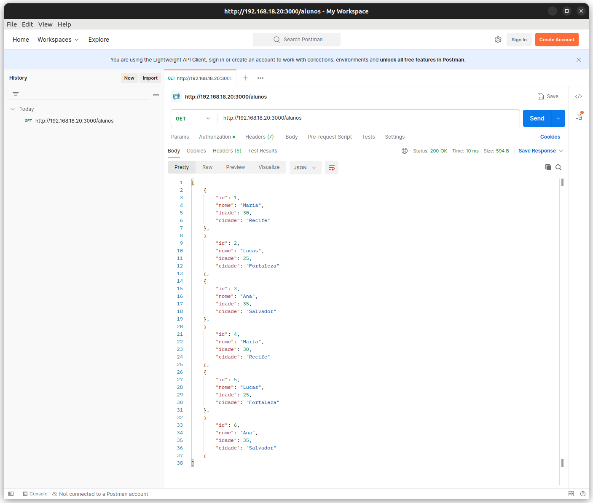
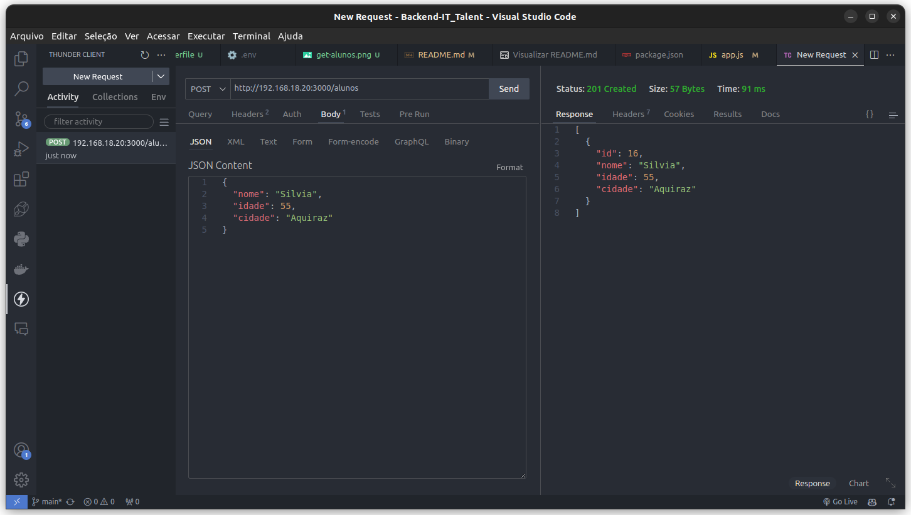
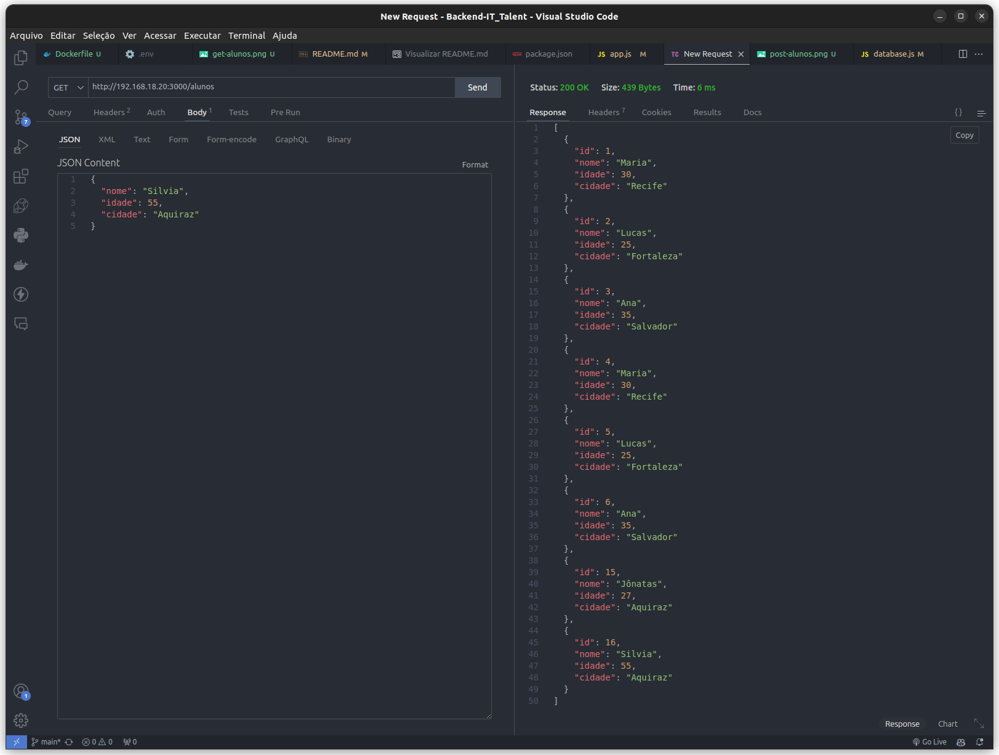

Claro! Aqui está um exemplo de um README bem documentado para o seu projeto.

## Projeto de Gerenciamento de Alunos

### Descrição
Este projeto consiste em uma API de gerenciamento de alunos, construída com Node.js, Express, e MySQL. A API permite listar todos os alunos, obter detalhes de um aluno específico e adicionar novos alunos.

### GET 

### POST

### GET - Após Create

